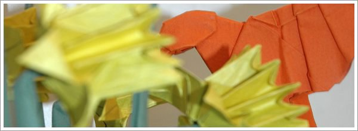

A maior alegria para quem dobra um pedaço de papel é quando, de um momento para o outro, alguém imediatamente atribui um significado à forma que surge no papel que acabamos de dobrar.

_Olha, é um passarinho!_

---

Desde novos que adoramos dar significados às formas. É inevitável e é mais forte que nós. Quem nunca tentou descobrir faces nas nuvens e figuras nas árvores? Quando olhamos para o céu estrelado, não conseguimos deixar de dar significado às constelações ainda que não sejam mais do que configurações ao acaso de estrelas no espaço.

Dobrar um pedaço de papel num objecto é transformar uma forma geométrica simples numa figura reconhecível. Partindo quase sempre do quadrado vazio emerge um padrão caótico de ângulos e arestas, ao qual vamos atribuindo ordem e significado - esta aba faz lembrar a cabeça, aquela aba o corpo - até que, eventualmente, por passos lentos e estranhos, a criatura com "vida" emerge.

É impossível identificar o momento em que ocorre a metamorfose uma vez que a transformação ocorre dentro das nossas mentes. No seu sentido mais abstracto, dobrar um animal em origami replica tanto o crescimento do animal, desde o óvulo fertilizado até adulto (as primeira dobras, simétricas, encontram paralelo no processo altamente mecânico que é a mitose de células) como replica a origem da própria vida. No papel, tal como a sopa cósmica primordial, caos dá origem à ordem, o vazio origina a forma, o escuro origina a luz.

---
