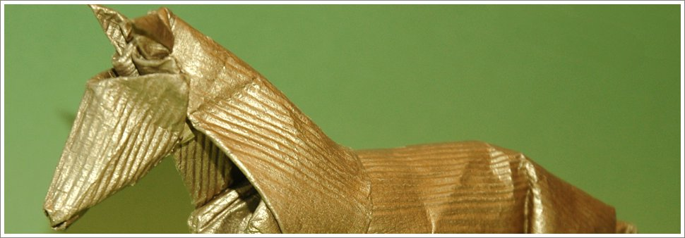

Origami é a arte tradicional japonesa de dobrar papel. Começou no século 17 DC e em meados de 1900 popularizou-se fora do Japão. Desde então, tem evoluído para uma forma de arte moderna.

Origami é uma palavra japonesa; ORI significa dobra, KAMI significa papel e juntos formam a palavra 'Origami'. O objectivo desta arte é transformar uma folha plana numa forma reconhecível recorrendo a dobras e técnicas de escultura.

Na forma mais simples e tradicional, o Origami não requere a utilização de ferramentas ou materiais complicados. É tão simples como pegar numa folha de papel. Porém há correntes mais puristas que outras e até mesmo o mais purista gosta de tempos a tempos de experimentar uma pequena liberdade. Um ligeiro corte, uma pequena pintura, etc. E porque não se o resultado final for forte e transmitir o significado que o seu autor pretende?

Porém, o que me atrai mais no Origami é precisamente a simplicidade nas regras tradicionais. Posso começar partindo de uma folha pintada, posso até começar a dobrar a partir de um triângulo, invés de um quadrado. Também faço Origami modular (vários modelos que encaixam). Mas tendo a seguir fielmente as regras tradicionais do Origami em todos os modelos. Como tal, para mim, o uso de cortes ou cola não fazem parte do origami.

---
