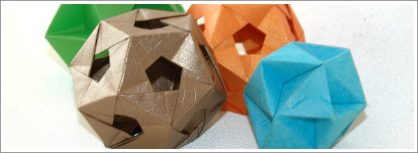

Para quem começa a dobrar ou ainda tem pouca experiência, aconselho a começar por entender bem os simbolos e as técnicas. É a melhor forma de evitar problemas no futuro e acima de tudo evitar as frustrações de não conseguir acabar um modelo!

Quem nunca fez origami, ver uma peça de origami complexa gera sempre alguma admiração. - Como terá sido possível fazer aquilo partindo de um simples quadrado? – É a questão mais usual. Mas depois quando o iniciante pega numa folha de papel e começa a dobrar é frequente que aquela motivação e admiração que tinha no início depressa se evapore.

Fazer origami é um processo de aprendizagem. Requer paciência. Não se pode pretender dobrar modelos complexos sem aprender primeiro como fazer os modelos mais simples. É necessário dominar as técnicas simples e dobras básicas. Da mesma forma, é necessário paciência em cada modelo que se dobre. Olhamos para modelos complexos e achamo-los bonitos mas esquecemo-nos que alguns levam muitas horas (e por vezes muitos dias…) a serem feitos. Dobrar um avião de papel faz-se em 2 minutos mas esse é o mais simples que se pode encontrar. Porém dobrar um elefante pode levar uma a três horas, dependendo da complexidade do modelo.

O meu conselho é precisamente paciência e dedicação. Dedique-se a estudar bem os símbolos e as dobras básicas. Quanto mais complexos são os modelos, mais os seus autores poupam em explicações e apelam a conjuntos de dobras pré estabelecidas. Sem uma base de conhecimentos, será muito difícil seguir esses diagramas mais complexos. Não pretenda fazer modelos demasiado complexos no início. Assim vai desanimar depressa. Faça modelos básicos e bonitos. Surpreenda os seus amigos numa esplanada de café, enquanto conversa com eles e faz sair um sapo das suas mãos. E com a surpresa manifestada pelos seus amigos vá ganhando motivação para prosseguir para modelos cada vez mais complexos.
