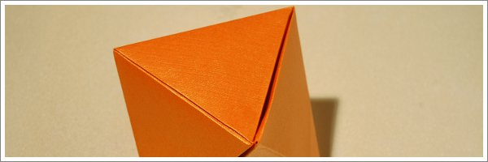

Para quem dobra, o quadrado é a origem de todas as formas. Estruturas geométricas, animais, objectos e até pessoas aparecem do quadrado e depois, quando desdobrados, desmontados, dissolvem-se novamente no quadrado que lhes deu origem. Onde alguns vêm um simples, vazio, aborrecido quadrado sem significado, aquele que o vai dobrar vê um mundo de possibilidades para dar vida ao quadrado.

Há muitas coisas que se podem fazer com uma simples folha de papel. Podemos amarrotá-la e deitá-la ao lixo. Podemos fazê-la passar pela aresta de uma mesa e torná-la arqueada. Podemos escrever na folha e assim torna-se uma carta. E depois se a colocarmos num bonito pedaço de papel (um envelope) e colarmos um outro pequeno pedaço de papel (um selo), pode vir a ser entregue a um amigo. Mas há certas coisas que apenas se conseguem fazer com um quadrado de papel. O quadrado tem propriedades geométricas que são usadas no origami. Para começar é regular. Tem quatro cantos, todos eles medindo o mesmo ângulo (90 graus). Tem quatro lados, todos eles com o mesmo comprimento. E tem no centro uma vasta, indiferenciada e pouco prometedora área. Um canto tem 90º de papel, uma borda tem 180º de papel e no meio temos 360º de papel.

No origami, a geometria é a ferramenta e o objectivo é a criação da representação de um animal, objecto ou até de um ser humano. Para o conseguir, temos de transformar o quadrado numa nova forma, criar uma aba de papel partindo dos cantos, bordas ou centro do quadrado para dar origem a cada membro da figura que estamos a tentar criar: uma cabeça, um pescoço, braços, pernas, patas, asas, hastes, chifres, antenas, caudas, etc.
