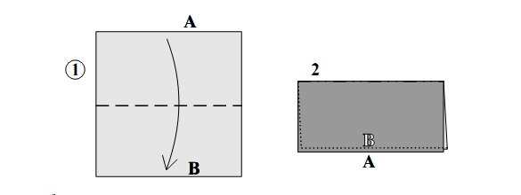
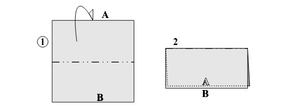
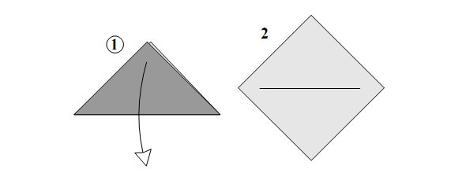
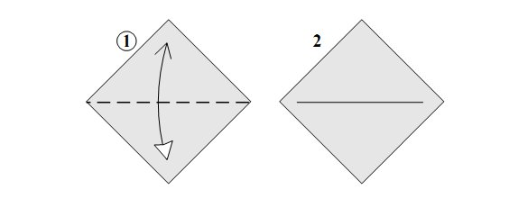

Pode parecer estranho mas a verdade é que todos os modelos origami são feitos a partir de pequeno conjunto de dobras. Assim, se aprender bem os seguintes símbolos e técnicas de dobra, não terá problemas em dobrar praticamente qualquer modelo de origami. Os tipos de dobras estão relacionadas entre si, pois todas são uma composição específica de dobras "em vale" e dobras "em montanha" (que curiosamente se distinguem conforme o ponto de vista, caso contrário, são exactamente a mesma coisa).

### A dobra em vale (Valley fold)

Uma dobra em vale (1) significa que a dobra é feita na sua direcção. No exemplo acima, você dobra a borda (A) para baixo de modo a encontrar a borda (B). Num diagrama uma dobra em vale é assinalada por um tracejado regular (traço, traço) e uma seta com ponta cheia.

### A dobra em montanha (Mountain fold)

Uma dobra em montanha (1) significa que a dobra é feita para trás do papel, para a longe de si. No exemplo acima, você dobra a borda (A) para baixo e por trás do resto do papel de forma a encontrar a borda (B). Uma dobra em montanha é registada num diagrama por um tracejado intercalado por ponto (traço, ponto, traço) e por uma seta com a ponta não preenchida.

### Desdobrar

Desdobrar uma dobra já feita é assinalado por uma seta com a ponta não preenchida. Este mesmo tipo de seta é usado para assinalar quando se tem que puxar uma camada de papel.

## Dobrar e desdobrar

Dobrar e desdobrar, ou “pré-dobra”, (1) não é mais que a combinação da dobra em vale com o desdobrar. É assinalado com uma seta de dobra em vale numa ponta (no sentido da dobra) e uma seta de desdobrar na outra ponta (no sentido para desdobrar).
