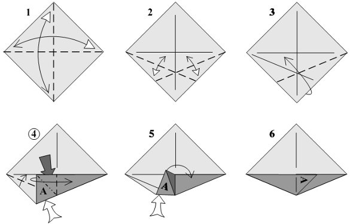

Tal como na múscias, onde existem notas base e depois uma infinidade de possiveis variações e combinações, no origami também existem dobras básicas que não são mais que uma dúzia delas. Depois variações dessas dobras básicas e diferentes combinações permitem que hajam um número infinito de possíveis modelos, mas quase sempre utilizando as dobras básicas abaixo descritas.

### Onda

Uma onda consiste uma dobra em vale seguida de uma dobra em montanha. Resulta num zig zag. Notar pelo tracejado assinalado (tracejado de dobra em vale ou de dobra em montanha) a dobra que fica do lado direito ou a que fica do lado esquerdo.

### Orelha de coelho (rabbit ear)

Uma dobra em forma de orelha de coelho consiste é uma combinação de 3 dobras em vale e uma dobra em montanha. É mais fácil de fizermos pré dobras (passos 1 e 2 da figura) de dobrarmos depois disso (passos 4, 5 e 6 da figura). Uma dobra de orelha de coelho também se consegue fazer usado a dobra giratória (ver abaixo).

### Dobra giratória (Swivel fold)

Uma dobra giratória significa dobrar um canto de forma que o papel é arrastado e força a dobrar também. A dobra giratória faz com que o papel marcado com (A) na figura rode em direcção da dobra.

### Dobra inversa (Reverse fold)

Para fazer uma dobra inversa interna (2 em cima), depois de pré dobrar (passo 1), abrir as camadas de papel e fazer um espinho (A) entre as camadas, dobrando para dentro das camadas. Para fazer uma dobra inversa externa (2 em baixo), após pré dobrar (passo 1), abrir as camadas de papel e dobrá-la por fora, ficado o espinho por fora das camadas de papel.

### Prega

Uma prega é uma combinação de duas dobras inversas. É preciso notar a dobra que fica do lado direito e a que fica do lado esquerdo pelo tipo de tracejado na figura. Na figura é possível ver os 3 tipos de pregas mais comuns.

### Dobra de achatar (Squash-fold)

Para fazer uma dobra de achar (1), separar as bordas do papel com o dedo entre as camadas de papel (passos 1 e 2) e achatar a aresta (A) (passos 2, 3 e 4).

### Dobra de pétala (Petal fold)

Uma dobra em pétala (2 da linha acima) torna mais fino e alonga um ponto (aqui o ponto C). Após pré dobrar conforme passo 1, dobrar o ponto (C) para cima (passo 3), de forma a que o ponto (A) e o ponto (B) se encontrem no meio (passos 4 e 5). Outro tipo de dobra em pétala (2 na linha abaixo da figura), cria um canto (aqui o ponto C) a partir de uma borda. Após pré dobrar conforme a figura (passo 1), empurrar ambos lados para o centro e o ponto (C) para cima (passo 2 e 3) e por fim achatar (passo 4). Pontos (A) e (B) devem encontrar-se no meio.

### Dobra de Estender e Espalmar (Spread squash fold)

Para fazer este tipo de dobra, primeiro fazer dobras em vale (passo 1). A seguir puxar o papel de forma a separa a camada da frente da camada de trás (passos 2 e 3) e achatar completamente (passo 3). Notar como o ponto A se move durante o processo. Tentar evitar que o papel ganhe pregas e rugas.

Outro tipo de dobra de estender e espalmar (linha de baixo da figura) é quando se achata um canto e o resultado é um triângulo e não um quadrado.

### Dobra de Afundar Solto (Open Sink fold)

Esta dobra é muito parecida com a Extender e Espalhar. A diferença é que, após separar a camada da frente da camada de trás até à distância que se pretende (passo 2 e 3) invés de achatar o papel, colocarmos o papel para dentro. O canto "A" da figura fica assim escondido.

### Dobra de Afundar Presa (Close Sink fold)

Para executar esta dobra convém sempre fazer pré-dobra conforme se vê na figura. Depois é começar a afundar o papel para dentro pelo base do canto (passo 3), depos afundar o resto completamente até ao fundo, mantendo as camadas de papel presas em conjunto (passos 4 e 5). O canto assim afundado e preso forma um bolso novo, uma cova nova.

### Dobra de Envolver (Wrap fold)

Envolver para trás -> linha de cima da figura.

Envolver para a frente -> linha de baixo da figura

A dobra de envolver ou enrolar é parecida com a dobra de afundar preso, mas ao envolver a camada de papel é rodada à volta de uma aresta invés de ser um canto a afundar para dentro da camada de papel. Para fazer esta dobra, abrir a aba que vai ser enrolada o mais possível (passos 2 e 3) e de um só passo inverter todo o conjunto (passos 3, 4 e 5). Por vezes, demontar algumas dobras ajuda a executar esta dobra.
