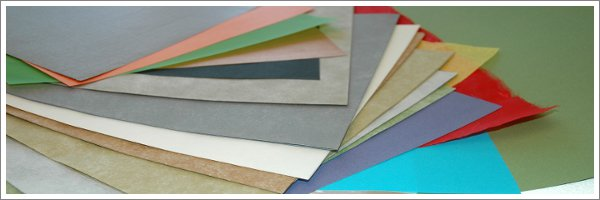

O que mais me atraiu no origami foi precisamente a facilidade com que se conseguem os materiais para começar. Há sempre um pedaço de papel à nossa volta. Uma folha de um caderno de apontamentos, ou de uma revista já lida, ou de uma fotocópia, podem ser dobrados em qualquer coisa engraçada.

Uma vez que o papel é o único meio à disposição de quem faz origami este deve conhecer o papel profundamente. É a sua tela, a sua tinta e o seu pincel. Qual é a sua cor? Qual a sua textura? Se o dobrarmos a meio e pressionarmos, aguentará as dobras ou abrirá novamente? Até quando é que aguenta se o esticarmos antes de rasgar? Passe o papel entre os dedos. O que é que sente? O que é que vai dobrar? Um avião? Uma flor? Um elefante? Um papel para dobrar uma flor pode não ser adequado para dobrar um elefante. Cada modelo tem uma complexidade própria, uma cor própria, uma textura própria e por isso, antes de começar, tem de se imaginar o modelo já dobrado para assim escolher o papel adequado.

Porém, quando descobri esta arte não havia folha que me escapasse. Dobrava em quase tudo o que me aparecia à frente. Numa esplanada de café, se alguém deixava um flyer de publicidade, nem olhava para o que era anunciado, preocupava-me era em passa-lo entre os dedos e ver se era demasiado grosso para dobrar. Portanto, o meu conselho é que dobre o papel que tiver disponivel e comece a conhecer as propriedades de cada tipo de papel. Com o tempo ganhará a capacidade de antecipar o resultado final de um modelo pela escolha de determinado papel.
