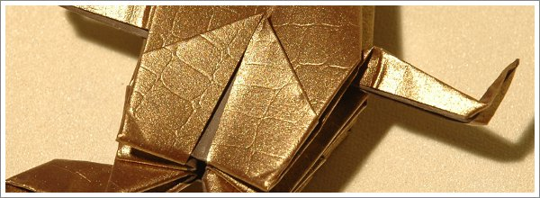

Para quem começa, o melhor papel é o papel fino e quebradiço e com a forma de um quadrado perfeito. Para os modelos simples há o papel japonês de origami, disponível em muitas lojas. Mas se não tiver acesso a papel de origami, não desespere. O papel corrente também serve para dobrar. Na realidade, eu aconselho a que no início não se preocupe muito com o papel que usa, o importante é começar a dobrar! Prefira papéis coloridos para efeitos mais interessantes. Mas conforme aumenta a complexidade dos modelos que escolhe, vai ser necessário ter atenção ao papel que utiliza. Muitos modelos que dobrei fracassaram pela má escolha de papel. Isso pode ser frustrante! A escolha do papel certo claramente determina o sucesso da conclusão do modelo e, acima de tudo, o aspecto final do modelo.

Para modelos mais complexos, principalmente para as primeiras vezes que os tentar dobrar, sugiro que utilize uma folha maior que o normal. Por exemplo, com 45 cm de lado. Vai ver que é mais fácil a execução do origami. Para certos modelos avançados, pode até tornar-se impossível dobrar com folhas menores que estas dimensões. Opte também por folhas finas porque em modelos complexos é normal acumularem-se muitas dobras “em cima” de dobras, ou acumularem-se várias camadas de papel. Nesses casos, com um papel grosso, torna-se mais difícil dominar as dobras nos passos finais do modelo. Ou então experimente as técnicas que à frente ensino (Papel Foil ou Papel Húmido) para quando a complexidade já é elevada e torna-se necessário recorrer a técnicas de preparação do papel.
