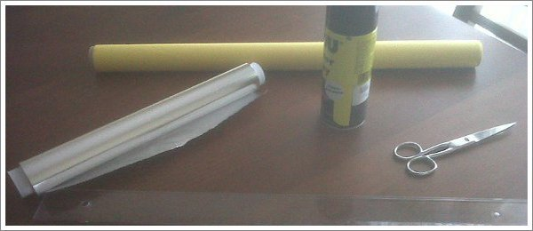
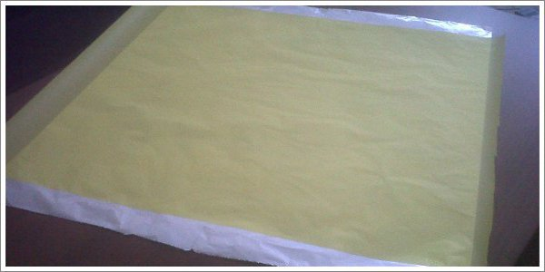

Devido à elasticidade natural do papel, há um relaxamento ao longo do tempo das dobras e curvas que não se aguentam na sua posição. Alguns artistas de origami desenvolveram técnicas de forma a tornar as dobras permanentes e para manter formas curvas sob tensão. A solução? Criar o seu próprio papel.

Um método conhecido, e que utilizo, é fazer uma _sandwich_ de papel de alumínio no meio de duas folhas de papel de seda. Também pode ser com papel de arroz.

### Preparar o papel Foil

Utilizando uma folha de alumínio grande, pulverizar essa folha com um spray aerossol de cola num dos lados. Depois pousar levemente a folha de papel de seda em cima da folha de alumínio e, enquanto a cola não seca, alisar as rugas com um rolo ou com uma régua. Cuidado para não rasgar o papel de seda. Depois é só repetir do outro lado. Como é difícil encontrar uma folha de alumínio suficientemente grande, eu utilizo os rolos de alumínio de cozinha banais. Coloco duas folhas de alumínio lado a lado. Seguro-as com fita-cola nas pontas para as manter em posição e bem juntas. Assim fica uma linha, uma “falha”, a meio. Mas como praticamente todos os modelos levam uma dobra a meio, esta falha é imperceptível se ambas folhas de alumínio foram coladas bem juntas, lado a lado.

Notar que convém utilizar jornais na superfície onde se faz esta operação. É que após a primeira pulverização de spray de cola a mesa vai ficar pegajosa. Na segunda pulverização, a folha vai colar à mesa. Não de forma permanente, mas não vai permitir a folha mover-lhe ligeiramente e alisar quando se estiver a colar o papel de seda. Isso vai resultar em bolhas e rugas no final. O que aconselho é, após cada pulverização, “descolar” a sandwich das folhas de jornal antes que a cola seque e rejeitar as folhas de jornal antes da próxima pulverização. Depois de concluído o processo, é só desenhar um quadrado com um lápis na sandwich preparada e cortar com um x-acto ou tesoura.

### O resultado

Este tipo de “papel” combina a maleabilidade do papel de alumínio (que aguenta melhor as formas e dobras imprimidas que o papel) e a durabilidade do papel (o alumínio rasga-se com facilidade após poucas dobras).

Tem porém o “defeito” de dar um ligeiro brilho metálico aos modelos. Esse brilho varia conforme o ângulo com que a luz incide no papel. Além disso este papel não serve para todos os modelos porque não permite dobras curvilíneas com facilidade. Também é mau quando se quer inverter uma dobra (passar de uma dobra em vale para uma dobra em montanha). O mais habitual é que se forme outra dobra ao lado da primeira quando queremos inverter uma dobra. E o resultado é uma cova, um ondulado, invés de uma dobra perfeita. Também já me aconteceu que, com o tempo, a sandwich começa a descolar porque a cola perde efeito. O papel de seda começa a separar-se da folha de alumínio. O papel também começa a ceder com o tempo, a libertar as dobras.

No entanto, uso esta técnica porque há modelos que justificam este papel. Ainda que necessite de uma preparação complicada para preparar o papel, depois é fácil de dobrar pois tem a vantagem de ser um papel fino e apesar disso dobrável e resistente.

Além disso, hoje existem lojas que vendem este papel já preparado e de óptima qualidade. Não só o papel não descola com facilidade como o resultado final é excepcional quando comparado com o papel preparado em casa.
