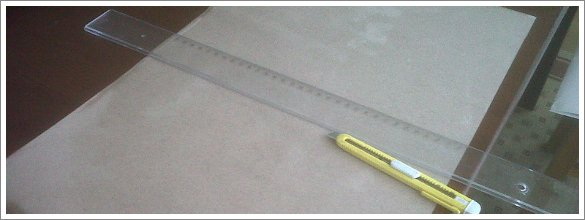

Para quem começa na arte do Origami, a técnica conhecida pelo nome de _“wet folding”_ pode não ser muito apelativa. Contudo, trata-se de uma técnica muito interessante e útil. Esta técnica, quando apareceu, estava envolta em secretismo, um pouco porque alguns puristas não concordam com esta e outras técnicas. Mas na realidade não tem segredo nenhum. Muito útil para dobrar animais e forma vivas, esta técnica permite fazer dobras rígidas e ao mesmo tempo curvas leves. O modelo fica com um aspecto muito mais sólido e tridimensional quando comparado com um modelo feito com papel seco. Além disso, permite usar folhas mais grossas e com maior probabilidade do modelo aguentar o seu próprio peso sem se desmanchar.

No essencial, a técnica envolve humedecer levemente o papel antes de o dobrar, depois dobrar rápida e suavemente antes que o papel seque e, por fim, permitir que o modelo seque com a forma desejada. É necessário ter atenção à tridimensionalidade dos modelos, pois o modelo tomará a forma com que secar.

### Como Preparar o Papel Húmido

Primeira regra, não molhar demasiado o papel! O papel deve ficar mole e maleável, mas não deve escorrer água. O segredo é quando brilhar é porque já tem água a mais. Permitir que seque um bocado antes de começar a dobrar no caso de ter água a mais. Pode ser útil um spray atomizador de água mas uma toalha ou pano faz o serviço. Aliás, para molhar o papel o basta um pano que se molha numa tina de água. Ás vezes uso uma esponja. Se não exagerarmos em absorver água, a esponja permite espalhar a água e ao mesmo tempo absorver o excesso de água que o papel tenha. O atomizador de água permite espalhar a água uniformemente, mas pode-se passar sem ele. Ao estender o papel que se vai dobrar numa superfície dura e lisa, passar o pano molhado pelo papel. Depois virar a folha, passar o pano molhado outra vez. Por fim, virar a folha e fazer uma última passagem.

Notar que quando se molha o papel ele expande. E expande no sentido das fibras do papel. O que quer dizer que se tiver um quadrado já cortado e o molhar deixa de ter quadrado para ter um rectângulo. Quando fizer a primeira dobra diagonal no quadrado vai ver que os cantos não se encontram. Portanto, é importante primeiro molhar o papel e depois cortar o quadrado com o papel molhado.

### Dobrar o Papel Molhado

Pode ser necessário tornar a humedecer o modelo durante a dobragem, mas é preferível evitar fazê-lo uma vez que não se consegue garantir que todas as camadas (principalmente as mais profundas) ficam humedecidas de forma uniforme. Importante também é assegurar que conhece bem o modelo que se vai dobrar de antemão. Se for para seguir um diagrama de um livro, é preferível dobrar antes o modelo num papel simples para conhecer bem os truques e dificuldades desse modelo. Tudo isto porque com o passar do tempo o papel vai sempre secando. Bordas e cantos tendem a secar mais rápido que o meio do papel. Conforme se vai dobrando, algumas das camadas ficarão inacessíveis para humedecer, e por isso aconselha-se a fazer o modelo de uma tirada, sem parar.

Portanto no wet folding é preciso dobrar rapidamente e de uma forma precisa. Se possível, dobrar no ar e não com o modelo pousado numa mesa. Ou pelo menos, dobrar no ar a partir do ponto em que o modelo começa a ficar com um tamanho mais pequeno e seja manejável sem o pousar na mesa. Isto porque o modelo vai ficar tridimensional. Ao pressiona-lo contra uma mesa estaremos a espalma-lo e a enfraquecer o papel.

Clips de papel e molas da roupa são úteis para segurar as camadas de papel enquanto secam. Aliás, eu recorro muito a clips de papel para deixar que o modelo seque na posição que desejo. Também um secador de cabelo pode ajudar a secar o modelo mais depressa mas cuidado porque secar umas partes do modelo mais rápido que outras pode levar a deformação do papel e do modelo.

### O Papel para Wet Folding

Quanto ao papel adequado para esta técnica. Tal como já disse, a escolha do papel é importante para o modelo que queremos dobrar. Mas além disso, para fazer wet folding nem todo o papel serve. O papel tem de ser capaz de absorver a humidade e ser grosso o suficiente para não se rasgar depois de húmido. A maioria do papel disponível no mercado e que serve para dobrar é mau para absorver água. Como resultado, muitas pessoas criam então o seu próprio papel. O que se pretende é um papel que absorva bem a humidade, mas que ao mesmo tempo seja flexível e dobrável mas que fique rígido quando volte a sequer. Há quem recorra a materiais como a metilcelulose (ou outros similares) ou a derivados de gomas de amido para colar duas folhas de papel mais fino. Isto dá resistência a um papel que inicialmente seria fraco para ser humedecido. Por sua vez a metilcelulose vai ser absorvida pelo papel e vai melhorar a sua capacidade de absorver humidade. Assim obtêm um papel com as características ideias para o wet folding.

Ainda assim é possível encontrar papel já feito que pode ser usado para humedecer. Eu recorro muito a cartolinas de papel Fabriano ou papel Canson. As cartolinas normais não servem porque não absorvem humidade. A gramagem que uso é de 160g/m2. Mais que isto é já é papel demasiado grosso.

### O resultado do Wet Folding

Confesso que foi com relutância que comecei a dobrar papel humedecido. É realmente necessário já estar num nível avançado de origami, isto é, já ter experiência. Por isso eu não aconselho a utilizar a técnica do papel humedecido se ainda não domina bem o origami. Mas esta técnica vale bem a pena. Ainda que seja difícil de dominar, não tem segredos e permite obter resultados permanentes e dignos de levar os modelos a exibições ou exposições.

Acima tudo, o que me fascina nesta técnica é que não requer tanta preparação quanto o papel foil se recorrermos a papel já feito (desde que seja papel capaz de absorver humidade). E depois o resultado é, diria, uma autêntica escultura. O modelo fica rígido quando seca e isso é perfeito. É frustrante ver as pernas de um cavalo a abrir-se para fora com o tempo conforme o papel vai cedendo e perdendo as dobras. Mas com o papel molhado, o papel aguenta-se nas dobras.

Pode ser mais difícil dobrar com o papel humedecido e parecer até estranho. Mas compensa largamente pelo resultado final.
