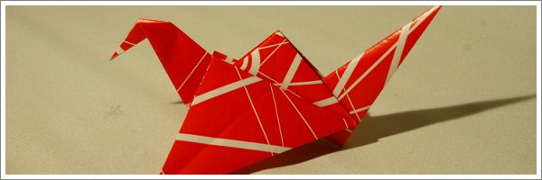
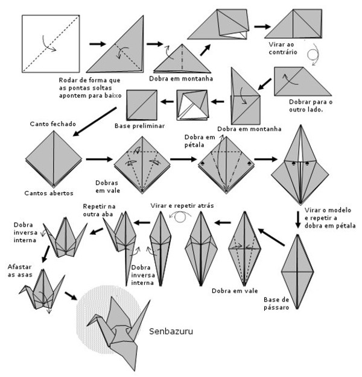
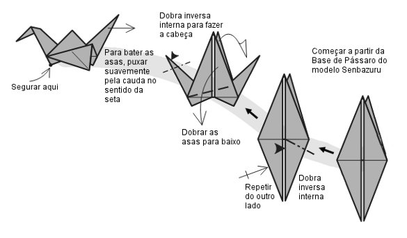

O pássaro que bate asas é também muito simples e parte da mesma base do anterior. É também um dos modelos mais popular e dos primeiros que toda a gente aprende quando começa a dobrar papel. Tem a vantagem de bater as asas, o que impressiona muita gente que também quer experimentar fazer bater as asas do pássaro.

<!--  -->

Para fazer este modelo tem de começar com a base de pássaro. Coloquei aqui o diagrama do Pássaro da Paz (Senbazuru) para saber como fazer a base de pássaro. Depois do passo da base de pássaro, siga o diagrama seguinte para fazer o pássaro que bate asas.

